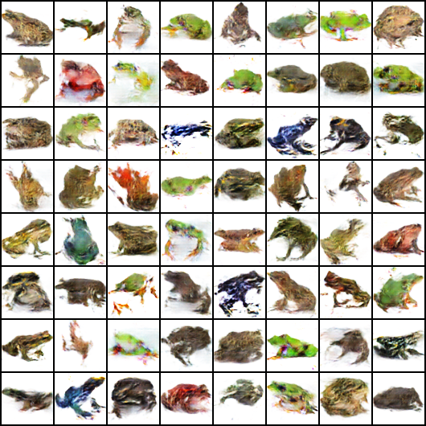
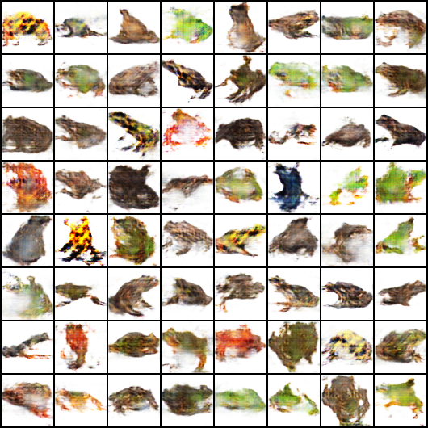
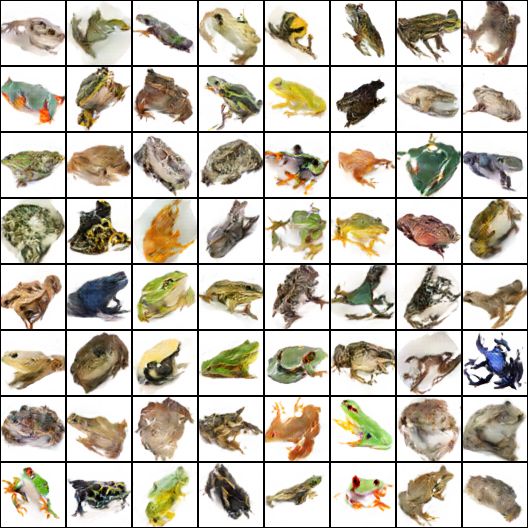
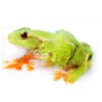
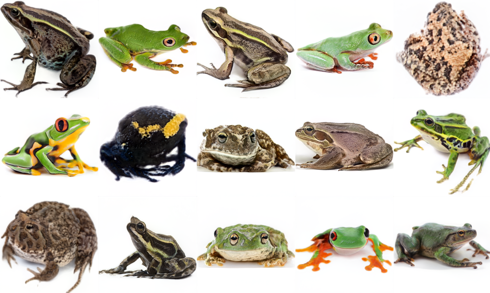

# List of pre-trained models with sample outputs

1. [Frogs 64 x 64 v1](#Frogs-64-x-64-v1)
1. [Frogs 64 x 64 v2](#Frogs-64-x-64-v2)
2. [Frogs 64 x 64 v3](#Frogs-64-x-64-v3)

## Frogs 64 x 64 v1 [Model](64x64-seed-127423-epoch-25-batch-64-lr-0.0002)

This model was trained with the following parameters:

| Resolution | Seed | Train epochs | Batch size | Lr | Dropout | Noise | Augmentations |
| --- | --- | --- | --- | --- | --- | --- | --- |
| 64 x 64 | 127423 | 25 | 64 | 0.0002 | 0% | 0% | Mirror |

### Sample:

## Frogs 64 x 64 v2 [Model](64x64-seed-127423-epoch-25-batch-128-lr-0.0002)

This model was trained with the following parameters:

| Resolution | Seed | Train epochs | Batch size | Lr | Dropout | Noise | Augmentations |
| --- | --- | --- | --- | --- | --- | --- | --- |
| 64 x 64 | 127423 | 25 | 128 | 0.0002 | 0% | 0% | Mirror |

### Sample:

## Frogs 64 x 64 v3 [Model](64x64-seed-127423-epoch-50-batch-128-lr-0.0001)

This model was trained with the following parameters:

| Resolution | Seed | Train epochs | Batch size | Lr | Dropout | Noise | Augmentations |
| --- | --- | --- | --- | --- | --- | --- | --- |
| 64 x 64 | 127423 | 50 | 128 | 0.0001 | 0% | 0% | Mirror + Rotate (0, 15, 30, 45) |

### Sample:

## Frogs 128 x 128 v1 [Model](128x128-i-forgot)

This model was retrained many times and i forgot the pipeline

### Sample:

## Frogs 128 x 128 v1 [Model](stylegan2-ada-512)

Trained on 512xc512 images

### Sample:

